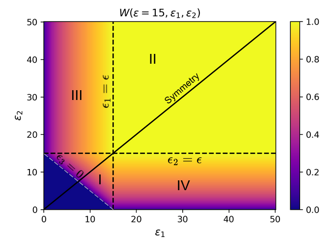
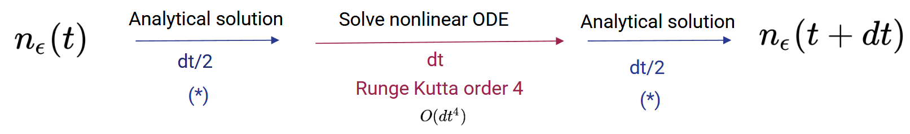

# Quantum Boltzmann kinetic equation

The quantum Boltzmann kinetic equation (QBE) describes the dynamics of a Bose gas following a quench (abrupt change of a parameter of the Hamiltonian). This equation describes the evolution of state populations under the effect of inter-particle collisions. In this project, we solve the equation for a 3D Bose gas initially in the normal phase and quenched either in the normal phase or in the Bose Einstein condensate (BEC) phase. For now, the project is divided into two subprojects:

1. General QBE solver 
   - 3D_kin_eq.py with two option modules:
      - naive_integration.py
      - precise_integration.py
2. QBE solver for a degenerate Bose gas evolving in a weak spatial disordered potential under the influence of an external drive 
   - split_step.py

## Physics

For more detail on the physics, see [References](#references).

1. General QBE

The dimensionless QBE describing the evolution of the energy distribution $n_\epsilon(t)$ solved in this subproject is :

$$
\partial_t n_{\epsilon} = C_{\text{int}}[n_\epsilon]
$$

where :

$$
 C_{\text{int}}[n_\epsilon] = \mathcal{I} \int_{\epsilon_1,\epsilon_2,\epsilon_3>0} d\epsilon_1 d\epsilon_2 W(\epsilon,\epsilon_1,\epsilon_2) [(n_{\epsilon} + n_{\epsilon_3})n_{\epsilon_1}n_{\epsilon_2}- (n_{\epsilon_1} + n_{\epsilon_2})n_{\epsilon}n_{\epsilon_3}],
$$

with $\epsilon$ is a dimensionless energy in units of $\epsilon_0 = \frac{\hbar^2}{2m}(4\pi^2\rho_0)^{2/3}$, the dimensionless time $t$ is in units of $\hbar/\epsilon_0$ and $\mathcal{I} = g^2m^3\epsilon_0/(2\pi^3\hbar^6)$ is a dimensionless parameter. The energy is conserved, giving $\epsilon_3 = \epsilon_1 + \epsilon_2 - \epsilon$. This equation is the same in all dimensions, except for the collision kernel $W(\epsilon,\epsilon_1,\epsilon_2)$ which in 3D is :

$$
W(\epsilon,\epsilon_1,\epsilon_2) = \frac{\text{min}(\sqrt{\epsilon},\sqrt{\epsilon_1}, \sqrt{\epsilon_2}, \sqrt{\epsilon_3})}{\sqrt{\epsilon}}.
$$

Since the system is isolated, both the number of particles and the total energy are conserved : 

$$
\begin{align}
\int_0^\infty d\epsilon \nu_\epsilon\ n_\epsilon(t)&=\rho_0, \\
\int_0^\infty d\epsilon \epsilon \nu_\epsilon\, n_\epsilon(t)&=\rho_0 E,
\end{align}
$$

where $\nu_\epsilon = (1/4\pi^2)(2m/\hbar^2)^{3/2}\sqrt{\epsilon}$ is the 3D density of states per unit volume.

2. QBE including the effect of disorder/drive

When adding the effect of weak disorder and drive, the QBE becomes 

$$
\partial_t n_{\epsilon} = C_{\text{int}}[n_\epsilon] + C_d[n_\epsilon],
$$

where

$$
C_d[n_\epsilon] = \mathcal{D}(\partial_\epsilon^2 + \frac{1}{2\epsilon}\partial_\epsilon) n_\epsilon,
$$

with $\mathcal{D} = (F^2D/2)\epsilon_0^3$, $F$ being the amplitude of the driving force and $D$ the diffusion coefficient.

## Numerical method

1. General QBE
   
The problem comes down to solving an initial value problem (IVP) of the form:

$$
\begin{align}
    \partial_t Y(t) &= f(Y(t),t) \\
    Y(t=0) &= Y_0,
\end{align}
$$

where $Y(t) = n_\epsilon(t)$ and $Y_0 = n_\epsilon(t=0)$ are 1D arrays containing the energy distribution at a given time. To integrate this IVP, we use the standard fourth-order [Runge-Kutta method (RK4)](https://en.wikipedia.org/wiki/Runge%E2%80%93Kutta_methods), for which the error of the integration is $O(h^4)$, where $h$ is the time-step. The r.h.s. of the equation f(Y(t),t) is a double integral which can be calculated for a given $\epsilon$ using an interpolation of the $n_\epsilon(t)$ grid to calculate the integrand. The loop over the different $\epsilon$ values is parallelized using the [joblib module](https://joblib.readthedocs.io/en/stable/).

Interpolation :
   - If method_interp is set to 'quadratic' : quadratic interpolation method (which works well in most cases)
   - If method_interp is set to 'PCHIP' : [PCHIP method](https://docs.scipy.org/doc/scipy/reference/generated/scipy.interpolate.PchipInterpolator.html) which conserves the monotony of the function (useful for calming numerical instabilities in the UV)

Integration : 
   - If method_int is set to 'naive' : the module naive_integration.py is used to calculate the double integral (integration on a 2D meshgrid using the Simpson method)
   - If method_int is set to 'precise' : the module precise_integration.py is used to calculate the double integral ([sinh tanh integration method](#references) over domains I,II,III,IV using symmetry properties shown below)

2. QBE including the effect of disorder/drive

This time to solve the IVP, we use the [Strang splitting method](https://en.wikipedia.org/wiki/Strang_splitting) : 

This consists of solving the IVP for linear and nonlinear operators separately for half time steps, using the analytical solution (*) of the linear term (see Supplemental material [References](#references) for details) and the numerical method for the nonlinear term (see general QBE).

## Precision and benchmarks

To estimate the precision of our simulations, we monitor norm conservation (essentially controlled by the number of interpolation points and the precision of integrals). Typically, for a sinh tanh method of order $4$ (in practice this leads to $\simeq 100$ integration points) and $2000$ interpolation points, the norm conservation is satisfied at $10^{-4}$ at $t=50$ and $10^{-2}$ at $t=1000$.

A useful benchmark for the general QBE is verifying that the distribution thermalizes to the Bose Einstein distribution at long times in the case of a quench in the normal phase:

## Example plots

Here are two examples for the general QBE (quench in the normal phase - red curves, quench across the BEC transition - blue curves):

## References

1. [E. Gliott, A. Rançon, N. Cherroret, PRL **133**, 233403 (2024)](https://journals.aps.org/prl/abstract/10.1103/PhysRevLett.133.233403)
2. [H. Takahasi and M. Mori. PM. RIMS **9**, 721-741 (1974)](https://ems.press/content/serial-article-files/41766?nt=1)
